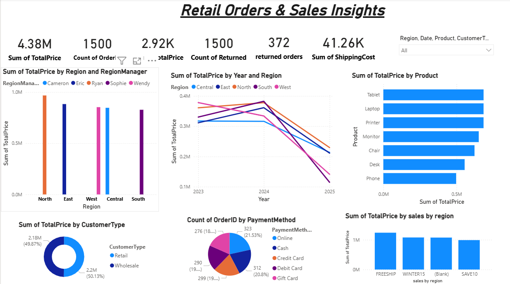

# Retail Orders & Sales Insights Dashboard

##Project Overview

This project is an interactive Power BI dashboard developed to analyze retail orders, sales performance, returns, products, regions, and payment methods.

 Objective

The objective of this project is to analyze retail sales data and identify important business insights related to sales performance, products, regions, customer segments, payment methods, and returns.

 Tools & Technologies

- Power BI
- Power Query
- DAX
- Data Cleaning
- Data Transformation
- Data Visualization

 Key Performance Indicators

- Total Sales: 4.38M
- Total Orders: 1,500
- Returned Orders: 372
- Retail Sales: 49.87%
- Wholesale Sales: 50.13%

 Key Insights

- North region recorded the highest sales performance.
- Tablets, laptops, and printers were among the top-performing products.
- Online and credit card were the preferred payment methods.
- Sales reached a peak in 2024.
- Sales declined in 2025.
- Returned orders accounted for approximately 25% of total orders.

 Dashboard Preview

 Dashboard Overview

Sales Analysis

 Product Analysis

 Skills Demonstrated

- Data Cleaning
- Data Transformation
- Power Query
- DAX
- KPI Development
- Data Visualization
- Business Analysis
- Power BI Dashboard Development

 Project Files

- `Retail-Orders-Sales-Insights.pbix` – Power BI dashboard
- `screenshots/` – Dashboard screenshots
- `README.md` – Project documentation
